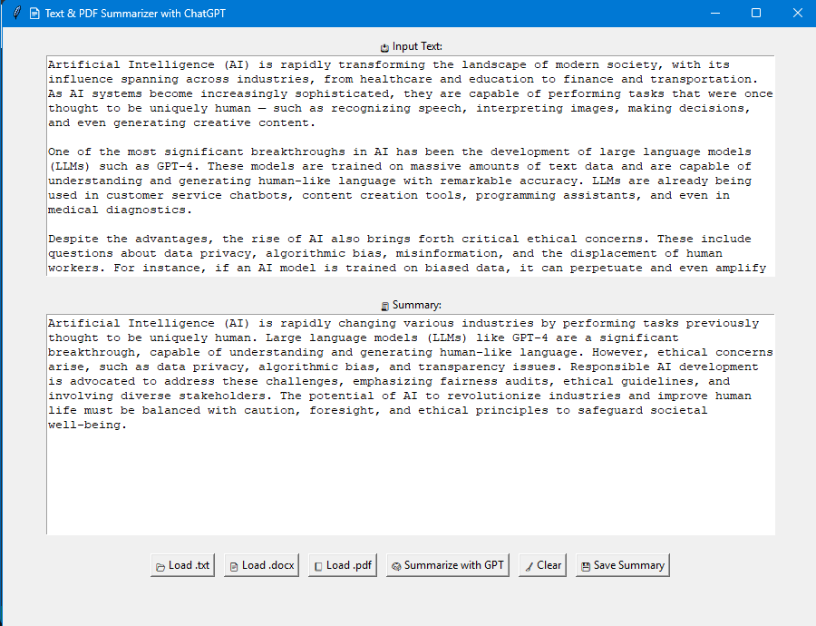

# 📚 PDF & Text Summarizer – Smart Python GUI App

Want to quickly extract and summarize content from PDF, TXT, or DOCX files without writing any code?

This project lets you upload a file, view the content in a user-friendly interface, and generate a clean summary with a single click — all in seconds! ⚡

---

## 🙋‍♂️ Why This Project?

This project helped me:

- Strengthen Python skills in file handling and GUI  
- Learn how to extract and process content from PDFs and Word files  
- Implement text summarization using OpenAI API  
- Build a complete user-facing application using Tkinter  
- Improve usability through design and simplicity

---

## 👋 What This Project Is About

This is a beginner-friendly tool for file reading and smart summarization using AI.  
Just pick a file — TXT, PDF, or DOCX — and get both the full text and a summarized version in seconds.

✅ No coding needed  
✅ AI-powered summaries  
✅ Clean GUI for interaction  

A smart utility blending **Python**, **OpenAI**, and a touch of **UX love**.

---

## 🖼️ Screenshot

<p align="center">
  
</p>

<p align="center"><em>📷 Upload interface with summary generator</em></p>

---

## 🔍 What It Can Do

- 📂 **Upload any of these file types**:  
  - `.txt`  
  - `.pdf`  
  - `.docx`
  
- 👀 **View content** in a clean text box  
- 🤖 **Generate summary** using AI (OpenAI API)  
- 📝 No clutter, no distractions — only what's important

---

## 🧰 Tech Used

| Tool        | What It Does                  |
|-------------|-------------------------------|
| Python      | Main programming language     |
| Tkinter     | GUI building                  |
| OpenAI API  | For generating summaries      |
| PyPDF2      | PDF reading                   |
| python-docx | Word file reading             |

---

## 💻 How to Run It

1. Clone the Repository
```bash
git clone https://github.com/chiragdhawan07/ai-document-summarizer-gui.git
```

2. Navigate into the project
```bash
cd ai-document-summarizer-gui
```

3. Install required libraries
```bash
pip install openai tkinter PyPDF2 python-docx python-dotenv
```

4. Add Your OpenAI API Key

5.  Run the Application
```bash
python ai_document_summarizer.py
```

---

## 🧩 Missing `tkinter`?

### 🖥️ Windows  
Tkinter usually comes with Python. If not, reinstall Python from [python.org](https://www.python.org/downloads/) and make sure to check **"Add Python to PATH"**.

### 🐧 Linux
```bash
sudo apt update
sudo apt install python3-tk
```

### 🍏 macOS (Homebrew)
```bash
brew install python-tk
```

---

## 🛠️ Notes

- You must set your **OpenAI API key** inside the script (in `openai.api_key`).
- Internet connection is required to generate summaries.
- This project avoids chunking messages into “Chunk 1”, “Chunk 2”, etc. — summary output is clean and direct.

---

## 👨‍💻 Author

Built with ❤️ by [Chirag Dhawan](https://github.com/chiragdhawan07)
